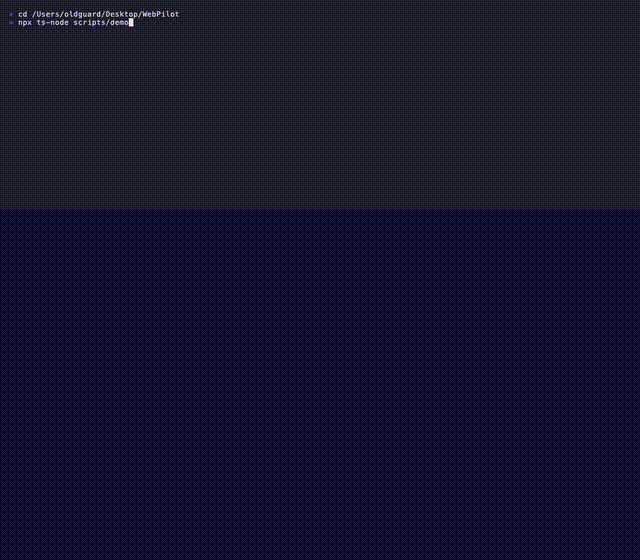

# WebPilot: AI-Native Test Automation & QE Platform

WebPilot is a production-grade, AI-native quality engineering (QE) framework built with Node.js, TypeScript, Playwright, and multi-agent AI loop architectures. It enables quality assurance and engineering teams to automate testing pipelines using plain, natural language test scripts. It automatically executes tests using cognitive reasoning, self-heals broken locators, supports interactive debugging, and generates enterprise-grade, deterministic Playwright test suites.

## Demo

[](https://github.com/javed0211/WebPilot/blob/main/assets/demo.webpilot.mp4)

*Click to open the full video · Natural language spec → CLI → browser agent → Playwright codegen*

Write tests in plain English, run one CLI command, and watch the browser agent execute your scenario in Chrome. WebPilot then generates Playwright TypeScript you can run in CI.

```bash
npm run webpilot -- run tests/web/automationexercise_add_to_cart.txt --env qa --headed
```

**Full demo (MP4):** [Watch on GitHub](https://github.com/javed0211/WebPilot/blob/main/assets/demo.webpilot.mp4)

---

## Documentation

| Guide | Contents |
|-------|----------|
| **[docs/FRAMEWORK_GUIDE.md](docs/FRAMEWORK_GUIDE.md)** | Architecture, writing tests, CLI reference, codegen, reports, CI |
| **[docs/USAGE.md](docs/USAGE.md)** | Quick start — install, credentials, run tests, troubleshooting |
| **[docs/CONFIGURATION.md](docs/CONFIGURATION.md)** | `webpilot.yaml`, `llm.json`, environments, prompts |

## Quick start

```bash
npm ci
npx playwright install chromium
pip install -r requirements.txt

cp .env.example .env   # optional: add API keys here
# Or fill azure section in config/llm.json (placeholders in repo)

npm run webpilot -- run tests/web/automationexercise_add_to_cart.txt --env qa --headed
```

`config/llm.json` is in the repo with **placeholder** keys only. Do not commit real API keys. Use `.env` for secrets (gitignored when it contains keys).

---

## 1. Architecture Overview

```
                                +-----------------------------------+
                                |            CLI Commands           |
                                |     (npm run webpilot -- ...)      |
                                +-----------------+-----------------+
                                                  |
                                                  v
                                +-----------------+-----------------+
                                |            Core Engine            |
                                |         (core/Engine.ts)          |
                                +-----------------+-----------------+
                                                  |
         +--------------------+-------------------+--------------------+--------------------+
         |                    |                   |                    |                    |
         v                    v                   v                    v                    v
+--------+-----------+ +------+------+ +----------+---------+ +--------+--------+ +--------+--------+
|   Planner Agent    | |  Executor   | | Validation Agent | |  Healing Agent   | |  Codegen Agent   |
| (PlannerAgent.ts)  | |  (Executor) | |(ValidationAgent) | |(HealingAgent.ts) | |(CodegenAgent.ts) |
+--------+-----------+ +------+------+ +----------+---------+ +--------+--------+ +--------+--------+
         |                    |                   |                    |                    |
         |                    v                   |                    v                    v
         |              +-----+------+            |             +------+-----+       +------+-----+
         |              | Playwright |            |             |  .healing- |       | /generated |
         |              |  Browser   |            |             |   -cache/  |       | TypeScript |
         |              +------------+            |             +------------+       +------------+
         v                                        v
  [Parses Test Input]                       [Runs Assertions]
```

---

## 2. Directory Structure

```
/Users/oldguard/Desktop/WebPilot
 ├── /config                    # Config-driven execution system
 │    ├── framework.json        # Central paths and options
 │    ├── browsers.json         # Browser viewport, screenshots and video settings
 │    ├── llm.json              # Provider models, temperature, and fallback chains
 │    └── /environments         # Multi-environment targets
 │         ├── dev.json
 │         ├── qa.json
 │         └── prod.json
 ├── /tests                     # Human-writable natural language specs
 │    ├── /web                  # Web UI tests
 │    └── /api                  # API REST/GraphQL narratives
 ├── /generated                 # PLAYWRIGHT AUTOMATION EXPORTS
 │    ├── /pages                # Generated Page Objects (POM)
 │    └── /tests                # Generated Playwright TS Spec Suites
 ├── /core                      # Core orchestration engine
 ├── /agents                    # Multi-agent specialized components
 ├── /plugins                   # Extensible Plugin SDK hooks
 ├── /reports                   # Trace files, videos, and JSON reports
 └── /.healing-cache            # Local selector mappings cache
```

---

## 3. CLI Developer Experience

We provide a robust set of CLI workflows. Execute commands using `npm run webpilot -- <command>` or direct `npm run` shortcuts:

### `npm run doctor`
Audits required directories, verifies environment credentials, and scans for active browser engine binaries:
```bash
npm run doctor
```

### `npm run init`
Scaffolds all framework directories and baseline JSON template configs:
```bash
npm run init
```

### `npm run webpilot -- create <type> <name>`
Instantiates a new BDD-style template script:
```bash
# Create a Web UI script
npm run webpilot -- create test user_login

# Create an API contract script
npm run webpilot -- create api user_profile
```

### `npm run webpilot -- run <file>`
Executes a natural language test script in fully autonomous mode:
```bash
# Run Web UI test in QA environment
npm run webpilot -- run tests/web/login.txt --env qa

# Run headed Chrome to visually observe execution
npm run webpilot -- run tests/web/login.txt --env qa --headed

# Specify clean Playwright Page Object Model output
npm run webpilot -- run tests/web/login.txt --architecture pom
```

### `npm run webpilot -- interactive <file>`
Launches Human-in-the-Loop interactive debugging mode. WebPilot displays the planned action and queries you for approval or prompt adjustments in the terminal before running it:
```bash
npm run webpilot -- interactive tests/web/login.txt
```

### `npm run report`
Aggregates JSON reports inside `/reports` and prints a high-density, gorgeous terminal summary:
```bash
npm run report
```

### `npm run webpilot -- self-heal`
Audits the list of selector overrides currently stored in the self-healing cache:
```bash
# View healed selectors
npm run webpilot -- self-heal

# Purge cache
npm run webpilot -- self-heal --clean
```

---

## 4. Test Script Specifications

Write natural language scripts using standard `.txt` files inside `/tests/web` or `/tests/api`.

### Web UI Scenario Templates

**BDD style** (`tests/web/login.txt`) — use `Given` / `When` / `Then` / `And` keywords:
```cucumber
@smoke @login
Test: User Login Scenario

Given user opens application
When user logs in with valid credentials
Then dashboard should be visible
```

**Simple numbered steps** (`tests/web/automationexercise_add_to_cart.txt`):
```
Test: Add Products in Cart

1. Navigate to https://automationexercise.com/
2. Verify that home page is visible successfully
3. Click on Products link in the navigation menu
```

**Simple plain steps** (`tests/web/automationexercise_contact_us.txt`) — one action per line, no keywords:
```
Test: Contact Us Form

Open https://automationexercise.com/
Verify home page is visible successfully
Click Contact Us link in the navigation menu
```

Use whichever format fits the scenario; the planner accepts all three. Tags (`@smoke`) and `Test:` title lines work in every format.

### Generated code quality

After a successful run, WebPilot generates Playwright POMs and specs with:

- **Strict semantic locators** — scope regions and use `.filter()` when multiple matches (`prompts/shared/locator-strict-rules.md`); full codegen rules in `prompts/`
- **BasePage reuse** — generated POMs call `navigate`, `click`, `clickByRole`, `assertCountAtLeast`, etc. from `framework/core/BasePage.ts`
- **Multi-page POM** — one class per route (e.g. `framework/pages/automationexercise/AutomationExerciseHomePage.ts`, `...ProductsPage.ts`, `...CartPage.ts`), not one file per site
- **Symbol graph reuse** — existing page methods are extended via AST merge into the correct page file only
- **Post-generation validation** — TypeScript compiler checks run on every generated file; the agent auto-fixes up to 2 rounds when errors are found (e.g. invalid `expect` APIs)

### API Pipeline Template (`tests/api/login_api.txt`)
```cucumber
@api @login
Test: API Token Chaining

Send POST request to {{baseUrl}}/api/login
With body payload {"username": "admin", "password": "password"}
Extract response body.token into token
Send GET request to {{baseUrl}}/api/users
With Headers {"Authorization": "Bearer {{token}}"}
Assert status is 200
```

---

## 5. Configuration Architecture

### LLM Setup (`config/llm.json`)

Set provider keys in `config/llm.json` and/or environment variables (see `.env.example` and [docs/CONFIGURATION.md](docs/CONFIGURATION.md)). The committed file uses placeholders only.

### Environment Mapping (`config/environments/qa.json`)
Configure variables and inject secrets using environment variables automatically interpolated at run time:
```json
{
  "environment": "qa",
  "baseUrl": "https://qa-app.company.com",
  "apiBaseUrl": "https://qa-api.company.com",
  "credentials": {
    "username": "${QA_USERNAME}",
    "password": "${QA_PASSWORD}"
  }
}
```

---

## 6. Self-Healing Capabilities

When WebPilot executes visual steps, it is backed by a cognitive locator recovery system:
1. If a button click or field input throws a locator `TimeoutException`, the **Self-Healing Agent** is invoked.
2. It captures the current DOM element tree and matches textual and structural anchors to locate the candidate element.
3. The healed locator is executed and persisted directly inside `/.healing-cache/cache.json`.
4. Subsequent runs bypass the AI overhead, loading healed locators instantly for maximum speed and determinism.

---

## 8. Docker & CI/CD Pipelines

### Execute Containerized:
Build and boot WebPilot using our included Noblesse-based Playwright container:
```bash
# Build
docker compose build

# Run
docker compose run webpilot
```

### GitHub Actions:
Our workflow `.github/workflows/ai-test.yml` automatically triggers on push or pull requests, runs `doctor` validations, executes tests via `npm run webpilot`, and archives artifacts (traces, videos, reports).
