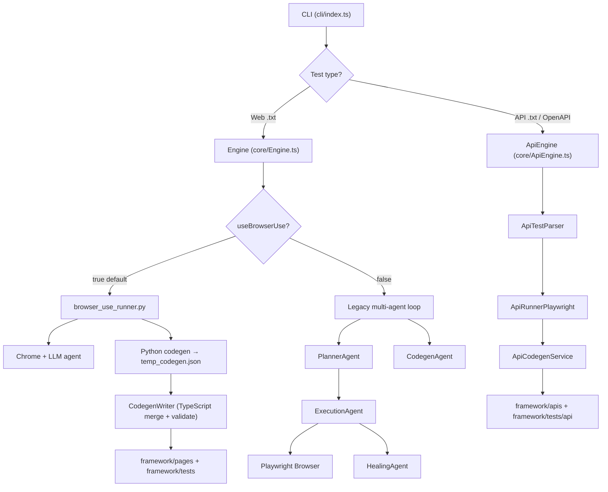
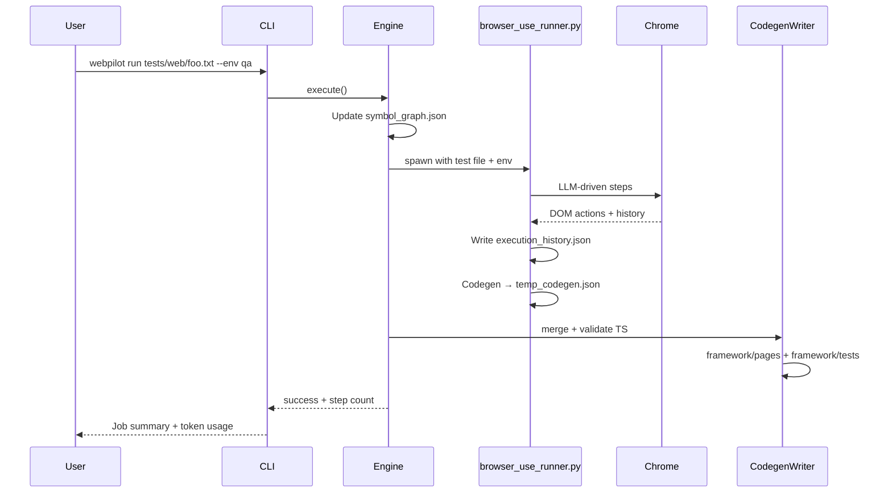
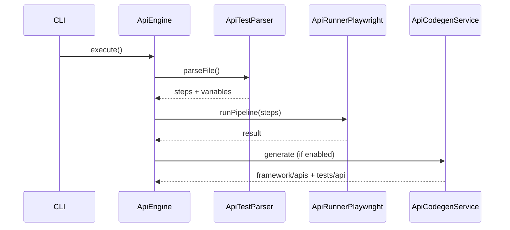

# WebPilot Framework Guide

WebPilot is an AI-native quality engineering platform. You write tests in plain English (`.txt` files), run them from the CLI, and WebPilot executes them in a real browser or over HTTP—then generates maintainable Playwright TypeScript you can run in CI without the LLM.

This guide covers architecture, test authoring, CLI commands, generated code, reports, and day-to-day workflows.

**Related docs**

| Document | Use when you need… |
|----------|-------------------|
| [USAGE.md](./USAGE.md) | Quick install and first run |
| [CONFIGURATION.md](./CONFIGURATION.md) | `webpilot.yaml`, `llm.json`, environments, prompts |
| [REPORTING.md](./REPORTING.md) | HTML reports, JSON artifacts, CLI, AI analysis, CI |
| [../README.md](../README.md) | Project overview and quick start |

---

## Table of contents

1. [Core concepts](#1-core-concepts)
2. [Architecture](#2-architecture)
3. [Project structure](#3-project-structure)
4. [Installation and setup](#4-installation-and-setup)
5. [Configuration](#5-configuration)
6. [Writing test cases](#6-writing-test-cases)
7. [CLI reference](#7-cli-reference)
8. [Execution flows](#8-execution-flows)
9. [Generated Playwright code](#9-generated-playwright-code)
10. [Self-healing](#10-self-healing)
11. [Reports and artifacts](#11-reports-and-artifacts)
12. [CI/CD and Docker](#12-cicd-and-docker)
13. [Best practices](#13-best-practices)
14. [Troubleshooting](#14-troubleshooting)

---

## 1. Core concepts

| Concept | Description |
|---------|-------------|
| **Natural language spec** | A `.txt` file in `tests/web/` or `tests/api/` describing what to test |
| **Environment** | Target URLs and credentials from `config/environments/<env>.json` (e.g. `qa`, `dev`, `prod`) |
| **Engine** | Orchestrator in `core/Engine.ts` — routes UI tests to browser-use or the legacy multi-agent path |
| **browser-use** | Python agent (`core/browser_use_runner.py`) that drives Chrome with an LLM (default UI path) |
| **Codegen** | After a successful run, WebPilot writes Page Object Models and Playwright specs under `framework/` |
| **Symbol graph** | AST index of existing page methods (`framework/symbol_graph.json`) so codegen extends rather than duplicates |
| **Healing cache** | Local map of broken → fixed selectors (`healing-cache/cache.json`) |

**Two test types**

- **Web UI** — browser automation; default path uses Python **browser-use**
- **API** — HTTP requests via Playwright `APIRequestContext`; no browser required

---

## 2. Architecture

### High-level overview



### UI execution paths

WebPilot supports two UI execution modes, controlled by `framework.useBrowserUse` in `config/webpilot.yaml`:

#### Path A — browser-use (default, recommended)

1. CLI invokes `core/browser_use_runner.py` with the test file and environment name.
2. Python loads LLM config from `core/llm_config.py` (merges `config/llm.json` + `.env`).
3. The **browser-use** agent opens Chrome (with WebPilot branding overlay) and executes your natural language steps.
4. Execution history is saved to `reports/<test>_execution_history.json`.
5. Codegen produces candidate files in `framework/temp_codegen.json`.
6. **CodegenWriter** merges new methods into existing POMs via AST (`SymbolParser`), validates TypeScript, and auto-fixes up to 2 rounds.
7. HTML report is generated if `framework.htmlReport: true`.

#### Path B — Legacy TypeScript engine

When `framework.useBrowserUse: false`:

1. **PlannerAgent** converts NL steps → structured JSON plan (`navigate`, `click`, `input`, `assert`, …).
2. **ExecutionAgent** reads the live DOM and decides the next Playwright action.
3. **ValidationAgent** checks assertions.
4. **HealingAgent** recovers broken locators and caches fixes.
5. **CodegenAgent** generates Playwright TypeScript from execution history.

Interactive mode (`webpilot interactive`) uses the legacy engine with human approval before each action.

### API execution path

1. **ApiTestParser** reads the file — regex for structured lines, LLM fallback for free-form prose, or OpenAPI import.
2. **ApiRunnerPlaywright** runs steps: HTTP requests, variable extraction, assertions.
3. On success, **ApiCodegenService** generates `framework/apis/<Name>Api.ts` and `framework/tests/api/<slug>.api.spec.ts`.

### Agent responsibilities

| Agent | File | Role |
|-------|------|------|
| Planner | `agents/PlannerAgent.ts` | NL → atomic step plan (legacy path) |
| Execution | `agents/ExecutionAgent.ts` | DOM-aware action decisions |
| Validation | `agents/ValidationAgent.ts` | Assertion verification |
| Healing | `agents/HealingAgent.ts` | Locator recovery + cache |
| Codegen | `agents/CodegenAgent.ts` | Playwright TS generation (legacy path) |

---

## 3. Project structure

```
WebPilot/
├── cli/                    # CLI entry (Commander.js)
├── config/
│   ├── webpilot.yaml       # Framework, browser, execution settings
│   ├── llm.json            # LLM providers (placeholders in repo)
│   └── environments/       # dev.json, qa.json, prod.json
├── tests/
│   ├── web/                # Natural language UI specs (.txt)
│   ├── api/                # Natural language API specs (.txt)
│   └── fixtures/           # Files for upload scenarios (e.g. sample.txt)
├── core/
│   ├── Engine.ts           # Main UI orchestrator
│   ├── ApiEngine.ts        # API orchestrator
│   ├── browser_use_runner.py # Default UI runner (Python)
│   ├── llm_config.py       # Shared LLM credential resolution
│   ├── api/                # API parser, runner, OpenAPI loader, codegen
│   └── execution_report/   # HTML/Markdown report generation
├── agents/                 # Multi-agent components (legacy UI path)
├── framework/              # Generated + canonical Playwright code
│   ├── core/               # BasePage, BaseAPI, fixtures
│   ├── pages/              # Page Object Models
│   ├── apis/               # Generated API client classes
│   ├── tests/              # Generated .spec.ts files
│   ├── config/             # Playwright-side ConfigManager
│   ├── playwright.config.ts
│   └── symbol_graph.json   # AST index of page methods
├── prompts/                # Editable LLM prompts (codegen, locators, reports)
├── reports/                # Run artifacts (gitignored)
├── healing-cache/          # Self-healing selector cache (gitignored)
└── scripts/
    └── setup-python.sh     # Creates .venv with browser-use
```

**What gets committed vs generated**

| Committed | Generated locally (gitignored) |
|-----------|-------------------------------|
| `tests/**/*.txt` NL specs | `reports/` |
| `framework/pages/`, `framework/tests/` (after codegen) | `playwright-report/`, `test-results/` |
| `config/`, `prompts/` | `healing-cache/` |
| `.env.example` | `.env` with real keys |

---

## 4. Installation and setup

### Prerequisites

| Requirement | Version | Purpose |
|-------------|---------|---------|
| Node.js | 20+ | CLI, TypeScript, Playwright |
| Python | 3.11+ | browser-use runner |
| Google Chrome | Latest | Default browser (`browser.target: chrome`) |
| LLM API access | Azure OpenAI default | Agent reasoning and codegen |

### Install

```bash
npm ci
npx playwright install chromium
npm run setup          # Python venv + browser-use in .venv/
cp .env.example .env   # Add your API keys
```

### Verify

```bash
npm run doctor
```

Doctor checks:

- Required directories exist
- LLM environment variables or `config/llm.json` resolve for browser-use
- Python + `browser_use` import successfully

### First run

```bash
npm run webpilot -- run tests/web/automationexercise_add_to_cart.txt --env qa --headed
```

---

## 5. Configuration

Full reference: [CONFIGURATION.md](./CONFIGURATION.md).

### Quick reference

| File | Purpose |
|------|---------|
| `config/webpilot.yaml` | Browser-use toggle, reports, browser, parallel workers |
| `config/llm.json` | Provider models (placeholders — use `.env` for secrets) |
| `config/environments/<env>.json` | `baseUrl`, `apiBaseUrl`, credentials |
| `.env` | Local secrets (gitignored) |

### Environment example (`config/environments/qa.json`)

```json
{
  "environment": "qa",
  "baseUrl": "https://automationexercise.com",
  "apiBaseUrl": "https://dummyjson.com",
  "credentials": {
    "username": "${QA_USERNAME}",
    "password": "${QA_PASSWORD}"
  },
  "variables": {
    "timeout": 30000,
    "retry": 2
  }
}
```

`${VAR}` placeholders are replaced from `process.env` at runtime. Set matching values in `.env`:

```env
QA_USERNAME=your_user
QA_PASSWORD=your_password
AZURE_OPENAI_API_KEY=...
AZURE_OPENAI_ENDPOINT=https://your-resource.openai.azure.com
AZURE_OPENAI_DEPLOYMENT=your-deployment
```

### Key `webpilot.yaml` flags

```yaml
framework:
  useBrowserUse: true          # Default UI path (Python browser-use)
  htmlReport: true             # Write reports/index.html after runs
  apiCodegenEnabled: true      # Generate API clients after API runs
  generatedCodePath: "./framework"

browser:
  target: chrome               # chrome | chromium | msedge
  headless: false              # Override with CLI --headed
  video: on
  trace: on
```

---

## 6. Writing test cases

Natural language specs live in `tests/web/` (UI) or `tests/api/` (HTTP). WebPilot accepts several formats for the same scenario.

### 6.1 Web UI tests

#### Metadata lines (all formats)

```text
@smoke @regression          ← optional tags (metadata only)
Test: My Scenario Title     ← required title line
                             ← blank line before steps
```

Tags are not executed — they help organize and filter tests manually.

#### Format 1 — Numbered steps (recommended for browser-use)

Best for precise, sequential UI flows:

```text
@smoke @cart
Test: Add Products in Cart

1. Navigate to https://automationexercise.com/
2. Verify that home page is visible successfully
3. Click on Products link in the navigation menu
4. Hover over the first product on the products page
5. Click Add to cart on the first product
```

See: `tests/web/automationexercise_add_to_cart.txt`

#### Format 2 — BDD (Given / When / Then)

```text
@smoke @login
Test: User Login Scenario

Given user opens https://demo.applitools.com/
When user logs in with username "Admin" and password "Admin123"
Then username "Jack Gomez" should be visible on left side bar
And settings icons should be visible on top bar
```

See: `tests/web/login.txt`, `tests/web/applitools-login.txt`

#### Format 3 — Plain steps (no keywords or numbers)

```text
Test: Contact Us Form

Open https://automationexercise.com/
Verify home page is visible successfully
Click Contact Us link in the navigation menu
Fill name field with "John Doe"
Upload file tests/fixtures/sample.txt
```

See: `tests/web/automationexercise_contact_us.txt`

#### Credentials in steps

Reference environment credentials implicitly:

```text
When user logs in with valid credentials
```

Or inline (demo/public sites only):

```text
When user logs in with username "Admin" and password "Admin123"
```

Environment credentials come from `config/environments/<env>.json` → `${QA_USERNAME}` / `${QA_PASSWORD}`.

#### File uploads

Place files under `tests/fixtures/` and reference them in steps:

```text
Upload file tests/fixtures/sample.txt in the attachment field
```

### 6.2 API tests

#### Structured plain-text (regex parser)

```text
@api @login
Test: API Authenticated Token Chaining

Send POST request to {{apiBaseUrl}}/auth/login
With body payload {"username": "emilys", "password": "emilyspass"}
Extract response body.accessToken into token
Send GET request to {{apiBaseUrl}}/auth/me
With Headers {"Authorization": "Bearer {{token}}"}
Assert status is 200
```

**Supported step verbs**

| Line pattern | Action |
|--------------|--------|
| `Send GET/POST/PUT/PATCH/DELETE request to <url>` | HTTP request |
| `With body payload {...}` | JSON request body |
| `With Headers {...}` | Request headers |
| `Extract response body.<path> into <var>` | Store response value |
| `Assert status is <code>` | Status code assertion |
| `Assert body contains "<text>"` | Body text assertion |

**Variables**

- `{{apiBaseUrl}}`, `{{baseUrl}}` — from environment config
- `{{token}}`, custom names — from `Extract` steps or environment

See: `tests/api/login_api.txt`

#### OpenAPI / Swagger sources

Point to a spec URL or file:

```text
@source https://petstore.swagger.io/v2/swagger.json
Test: Petstore smoke
```

Or import via CLI:

```bash
npm run webpilot -- import-api https://petstore.swagger.io/v2/swagger.json \
  -o tests/api/petstore_smoke.txt
```

Optional filter:

```bash
npm run webpilot -- import-api ./specs/petstore.yaml \
  -o tests/api/petstore_get.txt \
  --operations "GET /pet/{petId}"
```

#### Free-form API prose

If line-based parsing fails, WebPilot falls back to an LLM parser automatically.

### 6.3 Scaffolding new tests

```bash
# Web UI template (BDD style)
npm run webpilot -- create test user_login

# API template (token chaining)
npm run webpilot -- create api user_profile
```

Creates:

- `tests/web/user_login.txt`
- `tests/api/user_profile.txt`

---

## 7. CLI reference

All commands:

```bash
npm run webpilot -- <command> [options]
```

Shortcuts in `package.json`:

| npm script | Equivalent |
|------------|------------|
| `npm run doctor` | `webpilot doctor` |
| `npm run init` | `webpilot init` |
| `npm run report` | `webpilot report` |
| `npm run setup` | `bash scripts/setup-python.sh` |

### `init`

Scaffold directories, `BasePage`, `BaseAPI`, fixtures, and `framework/playwright.config.ts`.

```bash
npm run webpilot -- init
```

### `doctor`

Audit directories, LLM credentials, Python/browser-use, and LLM config resolution.

```bash
npm run doctor
```

### `create <type> <name>`

| Type | Output |
|------|--------|
| `test` | `tests/web/<name>.txt` |
| `api` | `tests/api/<name>.txt` |

```bash
npm run webpilot -- create test checkout_flow
npm run webpilot -- create api order_api
```

### `run <paths...>`

Execute natural language specs or directories.

```bash
# Single UI test
npm run webpilot -- run tests/web/login.txt --env qa

# Headed (visible browser)
npm run webpilot -- run tests/web/login.txt --env qa --headed

# Run all tests in a folder
npm run webpilot -- run tests/web --env qa --parallel 2

# API test
npm run webpilot -- run tests/api/login_api.txt --env qa

# Open HTML report after suite
npm run webpilot -- run tests/web --env qa --report
```

| Option | Default | Description |
|--------|---------|-------------|
| `-e, --env <env>` | `qa` | Environment from `config/environments/` |
| `--headed` | off | Visible browser |
| `--architecture <arch>` | `pom` | Generated code style: `flat`, `pom`, `bdd`, `pom-bdd` |
| `--parallel <n>` | `1` | Concurrent test workers |
| `--report` | off | Generate HTML report after run |

**Smart re-run behavior:** If `framework/tests/<name>.spec.ts` already exists, WebPilot runs the Playwright spec first. On failure, it falls back to AI execution/healing.

### `interactive <file>`

Human-in-the-loop mode — approve or override each action before execution. Always headed.

```bash
npm run webpilot -- interactive tests/web/login.txt --env qa
```

Prompts: `Approve? (y/n) | Or type override instructions:`

### `import-api <source>`

Import OpenAPI/Swagger into a natural language scenario file.

```bash
npm run webpilot -- import-api https://petstore.swagger.io/v2/swagger.json \
  -o tests/api/petstore_smoke.txt

npm run webpilot -- import-api ./openapi.yaml \
  --operations "GET /users,POST /users"
```

| Option | Description |
|--------|-------------|
| `-o, --output <file>` | Output path (default: `tests/api/<title>_openapi.txt`) |
| `--operations <ops>` | Comma-separated operations filter |

### `report`

View or regenerate execution reports.

```bash
# Terminal summary of recent runs
npm run report

# Regenerate HTML from existing JSON (no re-run)
npm run webpilot -- report --html
npm run webpilot -- report --html --no-ai
npm run webpilot -- report --html --test automationexercise_add_to_cart
```

| Option | Description |
|--------|-------------|
| `--html` | Generate `reports/index.html` and per-test HTML |
| `--no-ai` | Skip LLM quality analysis section |
| `--test <slug>` | Limit to one test |
| `-e, --env <env>` | Environment label in report header |

### `analyze`

Generate consolidated Markdown analysis across all executions:

```bash
npm run webpilot -- analyze
```

### `self-heal`

Inspect or clear the locator healing cache.

```bash
# List healed selectors
npm run webpilot -- self-heal

# Clear cache
npm run webpilot -- self-heal --clean
```

---

## 8. Execution flows

### 8.1 Web UI — end to end



During browser-use runs you will see:

- Blue border and **WebPilot** badge on the browser window
- Bottom status bar: current goal, tokens used, estimated cost

### 8.2 API — end to end



### 8.3 Running generated Playwright tests directly

After codegen, run deterministic tests without the LLM:

```bash
# All UI specs
npx playwright test --config=framework/playwright.config.ts --project=chromium

# All API specs
npx playwright test --config=framework/playwright.config.ts --project=api

# Single file
npx playwright test framework/tests/demoApplitools-login.spec.ts \
  --config=framework/playwright.config.ts
```

Set `ENV=qa` (or `dev` / `prod`) so `framework/config/ConfigManager.ts` loads the right environment.

---

## 9. Generated Playwright code

### Layout

| Path | Contents |
|------|----------|
| `framework/pages/<site>/` | Page Object Models extending `BasePage` |
| `framework/tests/*.spec.ts` | UI Playwright specs |
| `framework/apis/*Api.ts` | API client classes extending `BaseAPI` |
| `framework/tests/api/*.api.spec.ts` | API Playwright specs |
| `framework/core/BasePage.ts` | Shared navigate, click, fill, assert helpers |
| `framework/core/BaseAPI.ts` | Shared GET/POST, status/body/schema assertions |
| `framework/core/fixtures.ts` | Playwright fixtures (`apiClient`, etc.) |

### Code quality guarantees

WebPilot codegen follows rules in `prompts/shared/`:

- **Strict semantic locators** — scope regions, use `.filter()` when multiple matches
- **BasePage reuse** — generated POMs call shared helpers, not raw Playwright everywhere
- **Multi-page POM** — one class per route, not one file per site
- **Symbol graph merge** — new methods extend existing page classes via AST
- **Post-generation validation** — TypeScript compiler checks; auto-fix up to 2 rounds

### Example generated API spec

After running `tests/api/login_api.txt`:

```typescript
import { test } from '@core/fixtures';
import { ApiAuthenticatedTokenChainingApi } from '../../apis/ApiAuthenticatedTokenChainingApi';

test.describe('API: API Authenticated Token Chaining', () => {
  test('API Authenticated Token Chaining', async ({ apiClient }) => {
    const api = new ApiAuthenticatedTokenChainingApi(apiClient);
    await api.postApibaseurlauthlogin({ username: 'emilys', password: 'emilyspass' });
    await api.getApibaseurlauthme();
  });
});
```

---

## 10. Self-healing

When a locator fails during legacy engine execution:

1. **HealingAgent** captures the DOM and finds a candidate replacement selector.
2. The healed selector is tried immediately.
3. On success, the mapping is saved to `healing-cache/cache.json`.
4. Future runs load the cache first — no LLM call needed for known fixes.

```bash
# Audit cache
npm run webpilot -- self-heal

# Reset
npm run webpilot -- self-heal --clean
```

Configure in `config/webpilot.yaml`:

```yaml
execution:
  selfHealing:
    enabled: true
    similarityThreshold: 0.7
    autoUpdateCache: true
```

**Note:** The default browser-use path handles locator recovery inside the Python agent. Self-healing cache is most relevant for the legacy TypeScript engine and Playwright spec re-runs.

---

## 11. Reports and artifacts

Full guide: **[REPORTING.md](./REPORTING.md)** — HTML dashboards, JSON files, videos, traces, AI analysis, CLI, and CI.

| Artifact | Path |
|----------|------|
| HTML suite report | `reports/index.html` |
| Per-test HTML report | `reports/<test>-report.html` |
| Summary JSON | `reports/<test>_summary.json` |
| LLM usage | `reports/<test>_llm_usage.json` |
| Execution history | `reports/<test>_execution_history.json` |
| Videos / traces / screenshots | `reports/videos/`, `reports/traces/`, `reports/screenshots/` |

```bash
npm run report
npm run webpilot -- report --html
npm run webpilot -- run tests/web/foo.txt --env qa --report
npm run webpilot -- analyze
```

---

## 12. CI/CD and Docker

### Docker

```bash
docker compose build
docker compose run webpilot run tests/web/login.txt --env qa
```

Pass secrets via environment variables in `docker-compose.yml` or a local `.env` file (never commit real keys).

### GitHub Actions pattern

```yaml
- run: npm ci
- run: npx playwright install chromium
- run: npm run setup
- run: npm run doctor
  env:
    AZURE_OPENAI_API_KEY: ${{ secrets.AZURE_OPENAI_API_KEY }}
    AZURE_OPENAI_ENDPOINT: ${{ secrets.AZURE_OPENAI_ENDPOINT }}
    AZURE_OPENAI_DEPLOYMENT: ${{ secrets.AZURE_OPENAI_DEPLOYMENT }}
- run: npm run webpilot -- run tests/web --env qa --report
- uses: actions/upload-artifact@v4
  if: always()
  with:
    name: webpilot-reports
    path: reports/
```

### CI strategy

1. **Author** NL specs in `tests/` (committed).
2. **Generate** Playwright code via `webpilot run` (optional in CI if specs already committed under `framework/`).
3. **Run deterministic tests** with `npx playwright test --config=framework/playwright.config.ts` for fast, LLM-free CI.
4. **Re-run with AI** on failure for self-healing in nightly or manual workflows.

---

## 13. Best practices

### Writing effective NL tests

- **Be specific** — "Click Products link in the navigation menu" beats "Go to products".
- **One action per step** — easier for the agent to recover on failure.
- **Use numbered steps** for long flows — browser-use handles these reliably.
- **Put URLs in steps or environment** — `baseUrl` in env config for app-wide default; full URLs in steps when testing external sites.
- **Keep secrets out of specs** — use `${QA_USERNAME}` in environment config, not hardcoded passwords.

### Managing generated code

- Review and commit stable POMs under `framework/pages/` — they improve symbol graph reuse.
- Re-run `webpilot run` after UI changes; WebPilot merges new methods instead of duplicating files.
- Run `npx playwright test` locally before pushing generated specs.

### Cost control

- Monitor token usage in the CLI job summary and `reports/<test>_llm_usage.json`.
- Use `--headed` only when debugging.
- Prefer re-running committed Playwright specs over full AI runs in CI.

### Security

- Never commit `.env` or real keys in `config/llm.json`.
- Use `.env.example` as the template for teammates and CI secret names.
- Demo credentials (e.g. DummyJSON `emilys`/`emilyspass`) are fine for public examples.

---

## 14. Troubleshooting

| Issue | Solution |
|-------|----------|
| `browser_use not found` | Run `npm run setup`. Set `WEBPILOT_PYTHON` to your venv Python if needed. |
| Azure / LLM errors | Check `AZURE_OPENAI_*` in `.env`. Run `npm run doctor`. |
| Browser does not open | Use `--headed` or set `browser.headless: false` in `webpilot.yaml`. |
| Codegen TypeScript errors | Check terminal — validators auto-retry. Inspect `framework/temp_codegen.json` if present. |
| Empty reports | Run a test first; `reports/` is created per run. |
| Playwright spec fails, AI fallback slow | Fix generated spec or delete it to force fresh codegen. |
| Wrong environment URL | Verify `--env` flag matches `config/environments/<env>.json`. |
| API variable not substituted | Use `{{apiBaseUrl}}` syntax; set `apiBaseUrl` in environment config. |

### Useful debug commands

```bash
npm run doctor
npm run webpilot -- self-heal
npm run webpilot -- report --html --test <slug>
ENV=qa npx playwright test --config=framework/playwright.config.ts --debug
```

---

## Quick command cheat sheet

```bash
# Setup
npm ci && npm run setup && cp .env.example .env

# Health check
npm run doctor

# Create + run UI test
npm run webpilot -- create test my_flow
npm run webpilot -- run tests/web/my_flow.txt --env qa --headed

# Create + run API test
npm run webpilot -- create api my_api
npm run webpilot -- run tests/api/my_api.txt --env qa

# Import OpenAPI
npm run webpilot -- import-api https://example.com/openapi.json -o tests/api/smoke.txt

# Run generated Playwright (no LLM)
npx playwright test --config=framework/playwright.config.ts

# Reports
npm run report
npm run webpilot -- report --html
```
