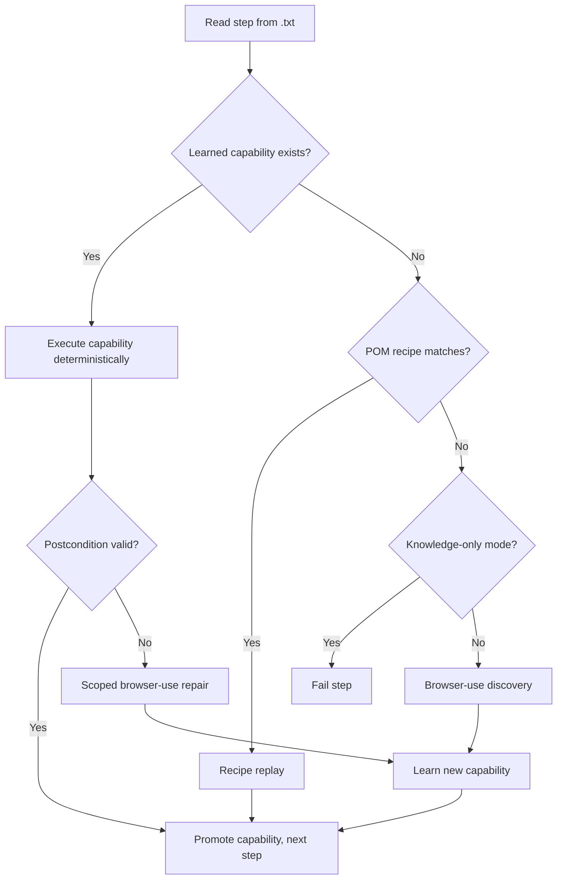

# Intelligent Runner & Site Knowledge

The intelligent runner is WebPilot's core execution engine. It turns natural-language steps into **learned, reusable automation** so repeat runs avoid LLM and DOM analysis.

---

## Problem it solves

AI browser agents are great for exploration but expensive and non-deterministic for daily use. SDETs need:

- First run: explore and learn locators per page
- Re-run same test: deterministic replay, no LLM
- Different test, same page: reuse page-level knowledge (cookie banner, login form, search box)
- Minimal token usage; AI only when something is new or broken

The intelligent runner delivers this **per step**, not all-or-nothing for the whole test.

---

## How it works



### Step 1 — Site knowledge replay

Learned capabilities live in `runtime/site-knowledge/knowledge.json`. Each capability stores:

| Field | Purpose |
|-------|---------|
| `step` / `stepSignature` | Normalized step text for matching |
| `origin` | Hostname (`www.booking.com`, `automationexercise.com`) |
| `before` | Page fingerprint before action (URL pattern, DOM anchors) |
| `actions` | Locators and action type (click, input, navigate, assert) |
| `after` | Expected postcondition |
| `successCount` / `failureCount` | Trust scoring |

Matching rules:

- Same step signature on the same origin
- Current page fingerprint matches `before`
- High-confidence capabilities are preferred

### Step 2 — POM-aligned recipes

For known applications, WebPilot includes deterministic recipes that mirror canonical page object selectors — without executing generated `.ts` files. Examples:

- Booking.com: `#onetrust-accept-btn-handler`, `input[name="ss"]`, autocomplete `li[role="option"]`
- AutomationExercise: Products nav, add-to-cart, View Cart modal

Recipes run via inline browser evaluation using the same selectors as `packages/test-framework/pages/`.

### Step 3 — Browser-use discovery

Only when knowledge and recipes cannot handle a step:

- A **scoped** browser-use agent runs **one step only**
- Captured actions are normalized into a new capability
- Cookie consent is dismissed before interactions
- Selector registry (`runtime/selectors/registry.json`) is consulted for high-confidence semantic selectors

---

## Configuration

In `resources/config/webpilot.yaml`:

```yaml
intelligentRunner:
  enabled: true
  knowledgePath: "./runtime/site-knowledge/knowledge.json"
  scopedAgentMaxSteps: 12
  performance:
    judgeMode: "verification"   # verification | always | off
    maxActionsPerStep: 6
    useVision: "auto"           # auto | always | off
    useThinking: true
    flashMode: false
    waitBetweenActions: 0.3
```

### Performance tuning

| Setting | Effect |
|---------|--------|
| `judgeMode: verification` | LLM judge runs only on verify/assert steps (saves tokens) |
| `judgeMode: always` | Extra LLM call per step (highest quality guard) |
| `judgeMode: off` | No independent judge |
| `maxActionsPerStep` | More actions batched per LLM round-trip |
| `flashMode: true` | Fastest; skips eval/next-goal/thinking (lower quality) |
| `waitBetweenActions` | Dead time between actions (page-load waits use browser-use defaults) |

Environment overrides:

```bash
WEBPILOT_JUDGE_MODE=verification
WEBPILOT_FLASH_MODE=0
```

---

## CLI modes

| Flag / env | Behavior |
|------------|----------|
| Default | Knowledge → recipes → browser-use for gaps |
| `--knowledge-only` / `WEBPILOT_KNOWLEDGE_ONLY=1` | Never call browser-use; fail on unknown steps |
| `--force-discovery` / `WEBPILOT_DISABLE_SITE_KNOWLEDGE=1` | Skip knowledge; always discover |

### Example: proven zero-LLM replay

```bash
# After first successful run:
WEBPILOT_KNOWLEDGE_ONLY=1 webpilot run tests/web/webpilot_live_checkout_2341.txt --env qa --provider browser-use
# Result: 5/5 steps reused, 0 LLM calls, ~20s
```

### Example: cross-test page reuse

```bash
# Run smoke test first (learns booking.com homepage)
webpilot run tests/web/booking_home_visibility_smoke.txt --env qa

# Different test file, same page — steps 1–5 replay without LLM:
WEBPILOT_KNOWLEDGE_ONLY=1 webpilot run tests/web/booking_search_hotels.txt --env qa
```

---

## Selector registry bridge

Two systems work together:

| System | Path | Used for |
|--------|------|----------|
| Site knowledge | `runtime/site-knowledge/knowledge.json` | Live step replay |
| Selector registry | `runtime/selectors/registry.json` | Codegen, confidence, fallbacks |

During replay, WebPilot prefers registry selectors (role, label, test-id) over brittle browser-use-captured text. During learning, icon-font noise is cleaned and semantic selectors are inferred.

---

## Capability lifecycle

```text
discovered → validated → trusted (after repeated success)
                ↓
           failure recorded → demoted → browser-use repair
```

Capabilities with high `failureCount` are deprioritized. Successful replays increment `successCount` and promote status.

---

## What gets logged

```text
[Knowledge] Step 2/5 deterministic: Click Products in the navigation menu
[Knowledge] Step 3/5 recipe replay: Enter "London" in the destination field
[Discovery] Step 6/11 Browser Use: Open the date picker
  - intelligent_runner: Reused 5 validated steps and learned 1 step with scoped Browser Use.
```

Summary JSON includes `reusedSteps` and `learnedSteps`.

---

## Limitations & roadmap

| Today | Planned |
|-------|---------|
| Recipes hardcoded for Booking + AutomationExercise | Generalize from registry/POM auto-discovery |
| Registry not always populated on live path | Auto-promote every successful step to registry |
| Healing not inline on browser-use path | Scoped repair with healing proposals |
| Knowledge keyed by step + origin | Broader page-level action library (e.g. "accept cookies" reusable across all tests on host) |

---

## Key source files

| File | Role |
|------|------|
| `src/integrations/browser_use/runner.py` | `run_intelligent_steps()` loop |
| `src/integrations/browser_use/knowledge.py` | Capabilities, recipes, registry bridge |
| `runtime/site-knowledge/knowledge.json` | Persisted learned steps |
| `runtime/selectors/registry.json` | Ranked selectors per page/action |

---

## See also

- [Execution & Replay](./execution-and-replay.md)
- [Selector Intelligence & Healing](./selector-intelligence-and-healing.md)
- [Deterministic Codegen](./deterministic-codegen.md)
